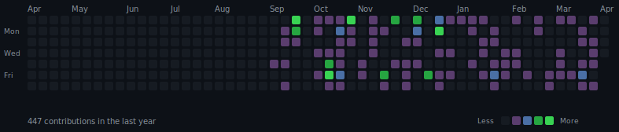

# Azure DevOps Commits Heatmap



## Setup

### 1. Create Azure DevOps PAT

1. Go to Azure DevOps → User Settings → Personal Access Tokens
2. Create new token with **Code (Read)** scope
3. Copy the token

### 2. Configure GitHub Repository

Add the following in your repository settings:

**Secrets** (Settings → Secrets and variables → Actions → Secrets):
- `AZURE_DEVOPS_PAT` — your Azure DevOps Personal Access Token

**Variables** (Settings → Secrets and variables → Actions → Variables):
- `AZURE_ORG` — your Azure DevOps organization name (e.g., `interscout`)
- `AUTHOR_EMAILS` — comma-separated list of your commit emails (e.g., `timo@example.com,timo@work.com`)

### 3. Run

The heatmap updates automatically every day at 6:00 UTC.

To run manually: Actions → Update Commits Heatmap → Run workflow

## Local Testing

```bash
export AZURE_DEVOPS_PAT="your-pat-here"
export AZURE_ORG="interscout"
export AUTHOR_EMAILS="your@email.com"

pip install requests
python scripts/generate_heatmap.py
```
# AzureCommitsExporter
